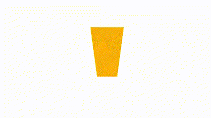

# Glass Filling
Animación de loading de un vaso rellenandose.

## Efectos CCS usados
- **Clip-path**: Crea una región de recorte que establece qué parte de un elemento debe mostrarse. Se muestran las partes que están dentro de la región, mientras que las que están fuera están ocultas
[Más información sobre el efecto](https://developer.mozilla.org/en-US/docs/Web/CSS/clip-path)

## Autor
El diseño original fue sacado de este [vídeo](https://www.youtube.com/shorts/X-HFEY5LP0M    )
